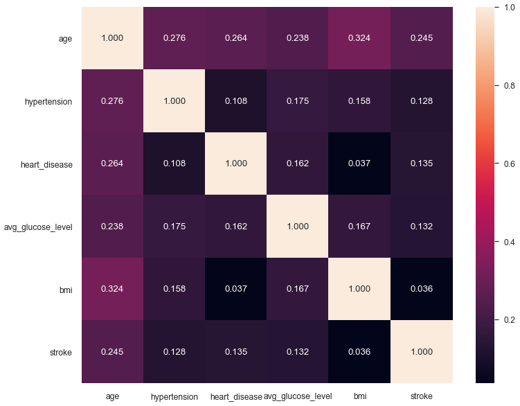

# Stroke Prediction

## Built with

<code></code>
<code></code>
<code></code>

<code></code>
<code></code>
<code></code>

## Summary

Found this dataset from [Kaggle](https://www.kaggle.com/fedesoriano/stroke-prediction-dataset) and was trying to learn Data Science skills by following the whole life cycle of a Data Science project. This dataset was used to investigate whether it is possible to predict stroke by using some features related of humans.

**NOTE**: This dataset is **_not good enough_** for modelling to predict stroke accurately. The trained model has **very low** F1 score and Recall score on predicting stroke, which essentially means most of the time it will just predict "Not Stroke". Although the proportion of humans suffering from stroke is also much lower in comparison with those who are not, it is still **not ideal** to tell many people that they are not likely to suffer a stroke when in fact they are!

There are 3 notebooks made to play with the dataset:

1. Exploratory Data Analysis (EDA) --> [stroke_prediction_EDA.ipynb](https://github.com/ansonnn07/stroke-prediction/blob/main/stroke_prediction_EDA.ipynb) 

2. Statistical Analysis --> [stroke_prediction_statistics.ipynb](https://github.com/ansonnn07/stroke-prediction/blob/main/stroke_prediction_statistics.ipynb) 

3. Feature Engineering and Modelling --> [stroke_prediction_modelling.ipynb](https://github.com/ansonnn07/stroke-prediction/blob/main/stroke_prediction_modelling.ipynb) 

I also have this notebooks uploaded to Kaggle.
1. https://www.kaggle.com/ansonnn/stroke-prediction-eda
2. https://www.kaggle.com/ansonnn/stroke-prediction-statistical-analysis
3. https://www.kaggle.com/ansonnn/stroke-prediction-modelling

Here are some of the example visualizations from the notebooks:

## Requirements

- numpy
- pandas
- matplotlib
- seaborn
- scikit-learn
- lazypredict

Optional: `pycaret` for testing in the [modelling notebook](https://github.com/ansonnn07/stroke-prediction/blob/main/stroke_detection_statistics.ipynb).

## Acknowledgements

Kaggle Dataset: [Dataset Source](https://www.kaggle.com/fedesoriano/stroke-prediction-dataset)  
Author: [fedesoriano](https://www.kaggle.com/fedesoriano)

Huge thanks to [Gaurav Sharma](https://www.kaggle.com/gauravsharma99) for his [EDA on MPG data notebooks](https://www.kaggle.com/gauravsharma99/eda-on-mpg-data). 
My notebooks are heavily inspired by his notebooks.
